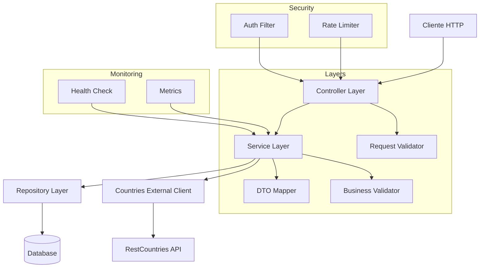
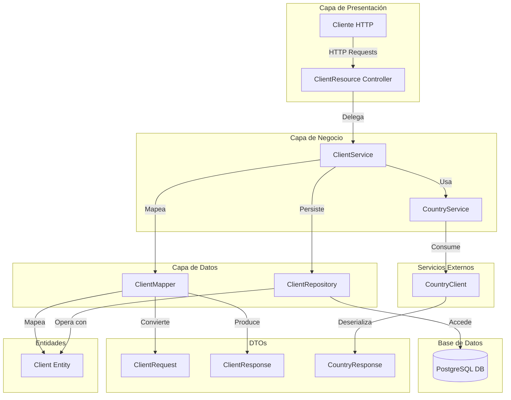
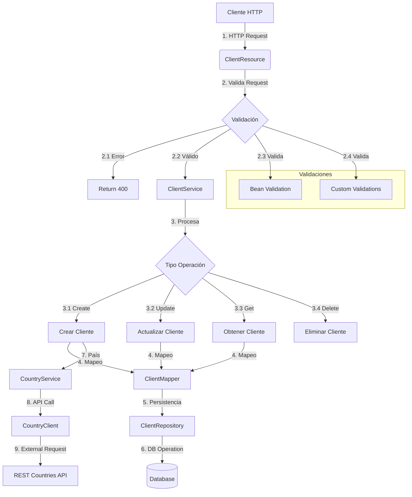

# API RestFull con Quarkus ⚙️

## Introducción

Esta RestFull ha sido desarrollada **Java** utilizando el framework **Quarkus**, que ofrece un rendimiento óptimo y facilidad de desarrollo para aplicaciones modernas. El proyecto utiliza **PostgreSQL** como base de datos para la persistencia de datos y está contenedorizado con **Docker**, facilitando su despliegue en cualquier entorno.


## 1. 🎉 Finalidad del Proyecto

**El objetivo principal** es **proveer una solución robusta, escalable y eficiente** para manejar información de clientes y obtener recursos de otros servicios (como información de países) dentro de una organización. Este proyecto aprovecha las ventajas de **Quarkus** y sigue una **arquitectura moderna basada en contenedores**, implementando **buenas prácticas de desarrollo** y garantizando una **arquitectura limpia y modular**.

🔑 **Características destacadas:**
- API **RESTful** que gestiona clientes de manera eficiente con funcionalidades **CRUD completas**.
- Soporte para **consultas personalizadas**, como búsquedas por país.
- **Validaciones avanzadas** (Bean Validation y personalizadas) para garantizar la **integridad de los datos**.
  

## 2. 📚 Estructura del Proyecto

El proyecto sigue una **estructura modular y escalable**, diseñada para garantizar la **mantenibilidad** y **extensibilidad** del código. A continuación, se detalla su organización:

```
src/
  main/
    java/com/banreservas/
      client/        # Componentes relacionados con la lógica del cliente
      controller/    # Controladores para manejar las peticiones HTTP
      dto/           # Objetos de transferencia de datos
      entity/        # Entidades del modelo de datos
      exception/     # Manejo centralizado de excepciones
      mapper/        # Mapeo entre entidades y DTOs
      repository/    # Clases para acceder a la base de datos
      service/       # Lógica del negocio

  test/
    java/com/banreservas/
      unit/          # Pruebas unitarias
      integration/   # Pruebas de integración
```
  
## 3. 🏛️ Arquitectura

El diseño del sistema sigue una **arquitectura en capas** clara, que asegura la separación de responsabilidades y permite un mantenimiento sencillo y escalable.




## 4. 🔍 Tecnologías Utilizadas

-  **Quarkus**: Framework para construir aplicaciones modernas en Java.

-  **PostgreSQL**: Base de datos relacional para la persistencia de datos.

-  **Panache Repository**: Simplifica el acceso a la base de datos mediante patrones comunes de repositorio.

-  **Docker**: Contenedorización de la aplicación.

-  **JUnit**: Framework para pruebas unitarias.

-  **Maven**: Sistema de gestión de dependencias y construcción del proyecto.
  


## 5. 🔧 Uso de Panache Repository

El **Panache Repository** facilita el acceso a la base de datos al proporcionar métodos predefinidos como `persist()`, `findById()`, y `delete()`, permitiendo concentrarnos en la lógica del negocio sin preocuparnos por los detalles del acceso a datos. Esto mejora la productividad y garantiza buenas prácticas.

---

🌐 **Buenas Prácticas Implementadas**

- **Separación de responsabilidades**: Controladores, servicios y repositorios bien definidos.
- **Control centralizado de excepciones**: Garantiza respuestas consistentes y amigables para el usuario.
- **Validaciones robustas**: Aseguran la calidad e integridad de los datos ingresados.
- **Uso de DTOs**: Aisla las entidades del negocio de las solicitudes/respuestas de la API.
- **Versionamiento de la API**: Uso de rutas como `/api/v1` para facilitar futuras ampliaciones.
- **Endpoints RESTful**: Diseñados para ser intuitivos y seguir estándares REST.
- **CamelCase en parámetros y minúsculas en rutas**: Para consistencia.

📊 **Diagrama de Componentes**

Este diagrama ilustra cómo interactúan los diferentes componentes del sistema, organizados en capas clave.


  

## 6. ☢️Requisitos Previos

> - Java Development Kit (JDK) 17
> 
> - Quarkus 3.17.6
> 
> - Docker Desktop
> 
> - PostgreSQL
> 
> - REST Assured (pruebas)
> 
> - Mockito (pruebas unitarias)

 

## 7. 🚀 Configuración y Despliegue

1️⃣ **Clonar el repositorio:**

```bash

git clone https://github.com/bryandejesusrt/restfull-api-clients.git

cd restfull-api-clients

```

2️⃣ **Configurar variables de entorno**

Crea un archivo .env en el directorio raíz y define las variables necesarias para la configuración del proyecto. Por ejemplo:

 
``` env

DATABASE_URL=jdbc:postgresql://localhost:5432/client_db

DATABASE_USER=admin

DATABASE_PASSWORD=admin123

SERVER_PORT=8080

COUNTRIES_API_URL=https://restcountries.com/v3.1/all

```

3️⃣ **Compilar la Aplicación**

Usa Maven para compilar el proyecto y generar el archivo JAR:

```bash
./mvnw clean package
```

4️⃣ **Configurar Docker**

a) _Levantar la Base de Datos con Docker Compose_

El proyecto incluye un archivo `docker-compose.yml` para configurar la base de datos PostgreSQL. Levanta los servicios con:

```bash
docker-compose up -d
```
Esto iniciará los contenedores necesarios, como la base de datos y otros servicios requeridos.

b) _Verificar Contenedores Activos_
Asegúrate de que los contenedores estén corriendo correctamente:
```bash
docker ps
```
---

# 8. 🏃‍➡️Ejecución del Proyecto

5️⃣ **Ejecutar la Aplicación**

Una vez que la base de datos esté corriendo, ejecuta la aplicación con:
```bash
java -jar target/client-api-1.0.0.jar
```
Esto iniciará el servidor en el puerto configurado en las variables de entorno (por defecto, 8080).

6️⃣ **Acceder a la API**

Puedes probar los endpoints de la API accediendo a:

**Documentación Swagger**:

`http://localhost:8080/swagger-ui.html`


## 9. 🔄 Métodos de la API

🔄 Métodos de la API

La API cuenta con los siguientes recursos principales:

- `/clients`:

- `GET /clients`: Obtener todos los clientes.

- `POST /clients`: Crear un nuevo cliente.

- `PUT /clients/{id}`: Actualizar un cliente existente.

- `DELETE /clients/{id}`: Eliminar un cliente.

- `/countries`:

- `GET /countries`: Obtener todos los países.


### 🌐 Flujo de Peticiones HTTP (Endpoints)

A continuación, presentamos el flujo general de una petición HTTP dentro del sistema, desde el cliente hasta la respuesta:


**Estandarización**

 - Rutas en minúsculas.
 - Parámetros en camelCase.

---

## 10. 🧪 Ejecución de Pruebas

Para ejecutar las pruebas del proyecto, utiliza:

```bash
./mvnw test
```

 1. Las pruebas incluyen:
 - Unitarias: Validación de métodos individuales.
 - Integración: Verificación de endpoints y conexión con la base de
   datos.

## 11. 📄 Agradecimientos

Este proyecto fue desarrollado como parte de un proceso de reclutamiento y para mi también de aprendizaje en Quarkus y refleja mi pasión por construir soluciones tecnológicas modernas y eficientes.

Agradezco a todas las personas y recursos que contribuyeron a este aprendizaje, incluyendo cursos y documentación oficial😅.

image

---

## 12. 📜 Licencia

Este proyecto está licenciado bajo la **licencia MIT.** Esto significa que puedes usar, modificar y distribuir el código de este proyecto libremente, siempre y cuando se incluya la atribución correspondiente al autor original.

Consulta el archivo **LICENSE** para más detalles.
